# 04 — Sơ đồ Luồng Nghiệp vụ & Hệ thống (Workflow & Sequence Diagrams)

Tài liệu này chuẩn hóa toàn bộ luồng tương tác người dùng (**User Flow**), luồng xử lý hệ thống (**System Flow**) và các biểu đồ tuần tự (**Sequence Diagrams**) trọng tâm của dự án **Hanoi Lens**. Tài liệu này là nguồn duy nhất cho các luồng (thay thế `flows/user-flow.md` và `flows/system-flow.md` cũ); kiến trúc xem [02_ARCHITECTURE.md](02_ARCHITECTURE.md), API xem [03_DATA_AND_CONTRACT.md](03_DATA_AND_CONTRACT.md).

---

## 1. Quy tắc luồng cốt lõi (Core Workflow Rules)

Mọi thành viên phát triển Android, Backend Spring Boot và AI Service phải tuân thủ tuyệt đối 7 quy tắc nghiệp vụ dưới đây:

1. **Đến nơi qua GPS mở khóa di sản ngay lập tức (GPS Arrival Unlocks Immediately):**
   - Việc xác nhận đến nơi thông qua kiểm tra ranh giới địa lý (`POST /v1/destinations/{destinationId}/arrival-checks`) sẽ **tự động mở khóa (unlock)** di sản đã đánh dấu trong hành trình.
   - Nhận diện địa danh bằng AI (Model 1 Vision) là tính năng **tùy chọn** khi chụp ảnh tại điểm đến, **tuyệt đối không** dùng làm điều kiện chặn (gate) việc mở khóa di sản.
   - Tọa độ GPS chính xác chỉ dùng một lần để kiểm tra hiện diện rồi hủy bỏ ngay trên RAM; vị trí trực tiếp trên bản đồ tham quan (`Visit map`) chỉ hiển thị cục bộ trên thiết bị (**on-device only**).

2. **Phân biệt rõ 2 trang Khám phá (Two Distinct Explore Pages):**
   - **Explore Hanoi (home):** Trang chính toàn ứng dụng hiển thị ngay sau khi đăng nhập (hoặc sau trang Landing đối với tài khoản mới), sau khi tạm dừng chuyến đi (`Pause`), hoặc khi quay lại từ Nhật ký hành trình (`Travel journal`). Bao gồm: bản đồ tổng thể, danh sách di sản, sự kiện văn hóa, nhật ký và nút tiếp tục chuyến đi đang tạm dừng (`Resume trip`).
   - **Heritage explore page:** Trang khám phá chuyên biệt của **một di sản cụ thể** khi người dùng đã đến nơi và mở khóa (hoặc khi bấm `Resume trip` / `Explore site` / `Continue exploring`). Hiển thị lịch sử tổng quan và danh sách các hạng mục/địa danh con (`landmarks`) bên trong di sản đó, trước khi mở vào `Visit map`.

3. **Hai điểm chạm của Trợ lý Lịch sử AI (Historical RAG Entry Points):**
   - **Trước khi đi (Pre-trip):** Nút hỏi đáp **Ask AI** luôn hiển thị trên trang **Heritage preview** (ngữ cảnh chỉ lọc theo `destinationId`, hoạt động độc lập không cần kết quả Vision).
   - **Tại điểm đến (On-site):** Bản đồ tham quan (`Visit map`) **không** có nút chat AI trực tiếp. Người dùng chụp ảnh -> hệ thống nhận diện địa danh (Model 1 đạt ngưỡng tin cậy) -> mở màn hình **Landmark info** -> từ đây mới mở **Chat with Historical AI** (ngữ cảnh lọc sâu theo `landmarkId`). Nếu nhận diện trả về `UNKNOWN` (dưới ngưỡng tin cậy), ứng dụng thông báo `UNKNOWN` và quay lại `Visit map`, không tự động chọn bừa địa danh.

4. **Phân nhánh Sự kiện Văn hóa (Event Branching & Event Memory Page):**
   - Khi xem chi tiết một sự kiện văn hóa (`Event detail`):
     - Nếu sự kiện **có gắn với một di sản** (`destinationId != null`): Chuyển tiếp sang trang **Heritage preview** của di sản đó để đi theo luồng hành trình di sản chuẩn.
     - Nếu sự kiện **không gắn với di sản cố định** (`destinationId == null`): Mở trang **Event memory page**, cho phép người dùng chụp ảnh kỷ niệm sự kiện và lưu trực tiếp vào **Travel journal**.

5. **Vòng đời Hành trình (Journey Lifecycle):**
   - Tuân thủ máy trạng thái: `ACTIVE ⇄ PAUSED → ENDED` (tối đa **01 hành trình `ACTIVE`** trên mỗi người dùng tại một thời điểm).
   - Người dùng phải **Đánh dấu di sản vào hành trình (`Mark heritage in the trip`)** trước khi di chuyển. Chuyến đi có thể tạm dừng (`Pause`) để về `Explore Hanoi (home)` và tiếp tục (`Resume trip`) bất cứ lúc nào.

6. **Kết thúc điểm thăm, Bộ sưu tập Tem & Trao thưởng (Stamp Collection & Reward Check):**
   - Khi người dùng chọn **Finish here / Finish visit** tại điểm đến, hệ thống **mở Bộ sưu tập Tem (`Stamp collection`) trước**, sau đó mới đối soát danh sách di sản đã đánh dấu (`marked`) so với di sản đã mở khóa (`unlocked`).
   - Nếu **tất cả di sản đã đánh dấu đều đã được mở khóa** (`All marked heritages unlocked? == Yes`), người dùng nhận **Huy hiệu Dấu hành trình (`Journey Stamp badge`) và phần quà ngẫu nhiên (`random gift`)**. Sau đó người dùng có thể chọn tiếp tục khám phá tại `Heritage explore page` hoặc lưu tiến trình, kết thúc chuyến đi (`ENDED`) và cập nhật **Travel journal**.

---

## 2. Bộ ảnh sơ đồ trực quan (Rendered Diagrams Gallery)

Các sơ đồ chuẩn hóa đã được kết xuất thành ảnh PNG độ phân giải cao trong thư mục `docs/Diagram/` (nguồn StarUML tại `docs/Diagram/HanoiLens.mdj` và trình sinh HTML tại `docs/Diagram/HTML/src/`):

### 2.1. Bộ ảnh User Flow (3 giai đoạn)

| Giai đoạn | File ảnh | Xem trực quan |
| :--- | :--- | :--- |
| **1/3 — Đăng nhập & Khám phá (Sign in and discover)** | [user-flow-1-discover.png](Diagram/user-flow-1-discover.png) | 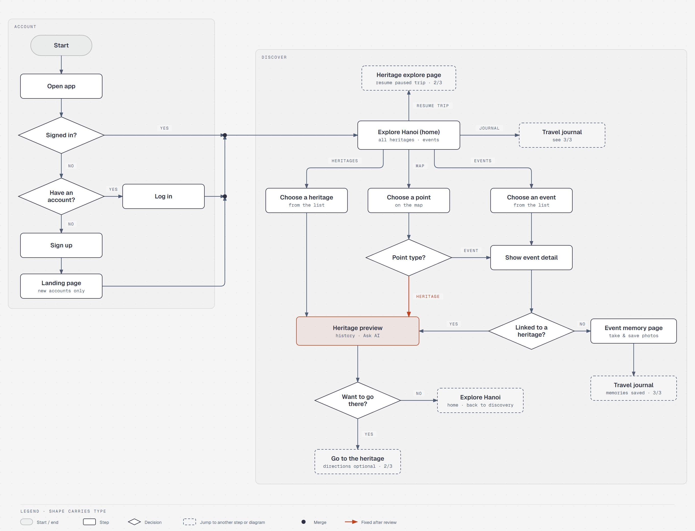 |
| **2/3 — Hành trình: Đánh dấu, Đến nơi, Mở khóa, Tham quan & Nhận thưởng** | [user-flow-2-trip.png](Diagram/user-flow-2-trip.png) | 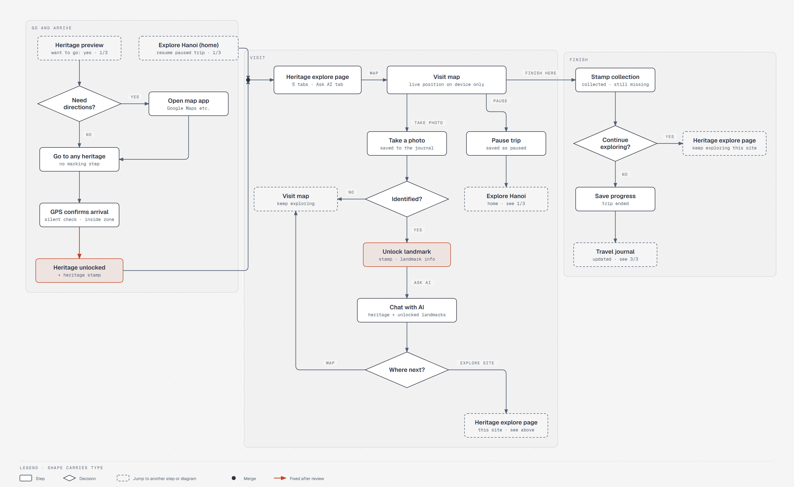 |
| **3/3 — Nhật ký hành trình (Travel journal)** | [user-flow-3-journal.png](Diagram/user-flow-3-journal.png) | 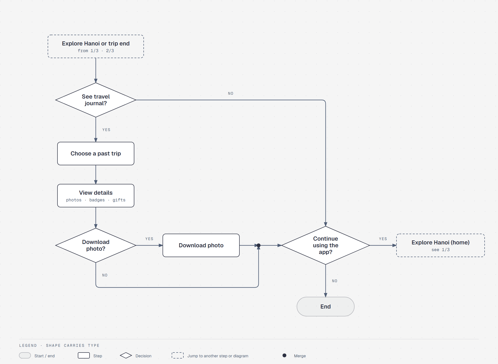 |

### 2.2. Bộ ảnh System Flow (5 phân đoạn)

| Phân đoạn | File ảnh | Xem trực quan |
| :--- | :--- | :--- |
| **1/5 — Phiên đăng nhập & Khởi tạo (Session and sign-in)** | [system-flow-1-session.png](Diagram/system-flow-1-session.png) | 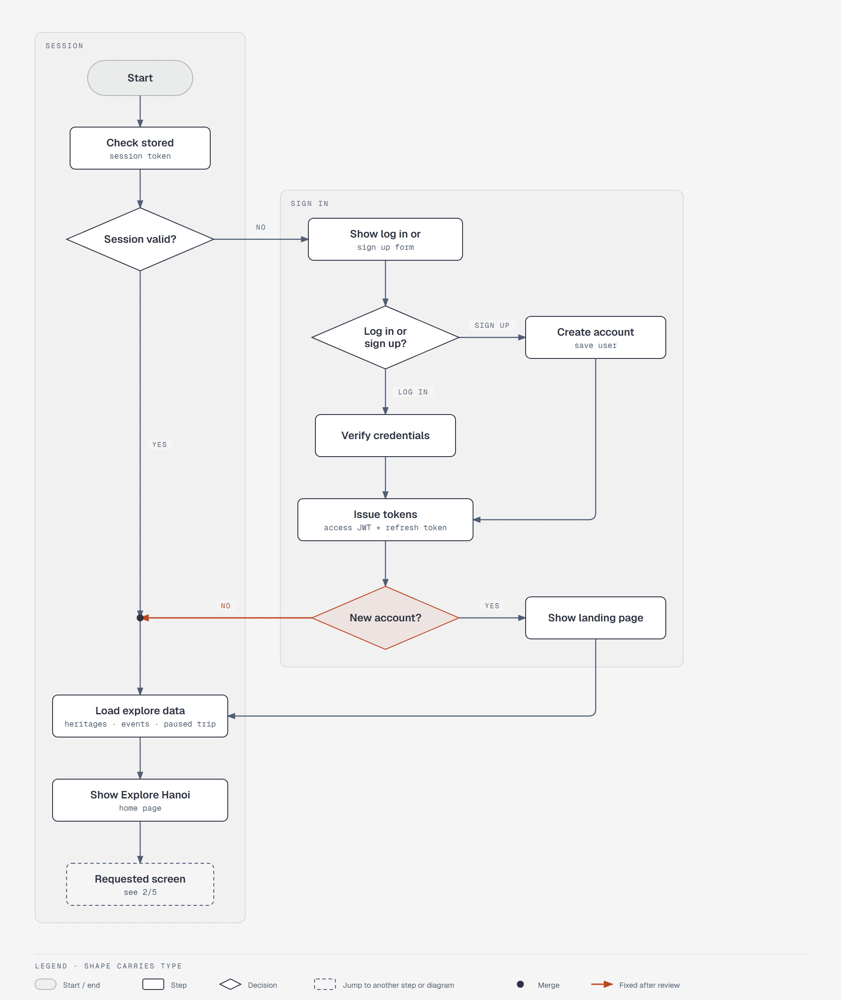 |
| **2/5 — Khám phá, Xem trước & Kỷ niệm sự kiện (Discovery, preview & event memories)** | [system-flow-2-discover.png](Diagram/system-flow-2-discover.png) | 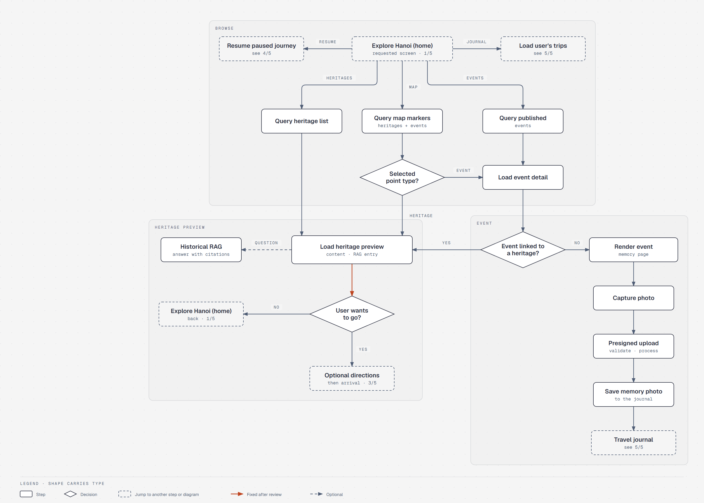 |
| **3/5 — Đánh dấu, Kiểm tra đến nơi & Mở khóa (Mark, arrive and unlock)** | [system-flow-3-arrival.png](Diagram/system-flow-3-arrival.png) | 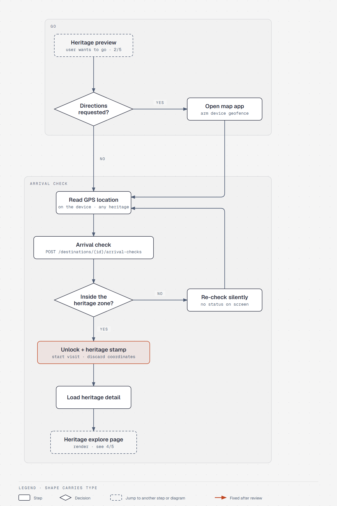 |
| **4/5 — Bản đồ tham quan, Chụp ảnh & Nhận diện AI (Visit map, photos & recognition)** | [system-flow-4-visit.png](Diagram/system-flow-4-visit.png) | 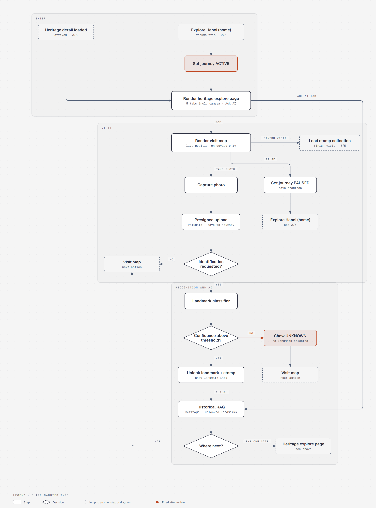 |
| **5/5 — Trao thưởng, Kết thúc hành trình & Nhật ký (Reward, journey end & travel journal)** | [system-flow-5-finish-journal.png](Diagram/system-flow-5-finish-journal.png) | 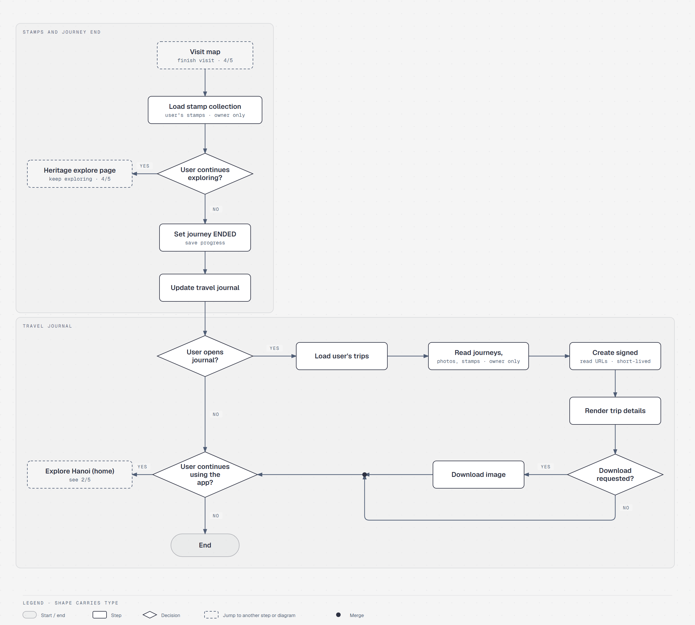 |

---

## 3. Sơ đồ Luồng Người Dùng (User Flow — 3 Giai đoạn)

### 3.1. Giai đoạn 1: Đăng nhập & Khám phá (Sign in and discover)

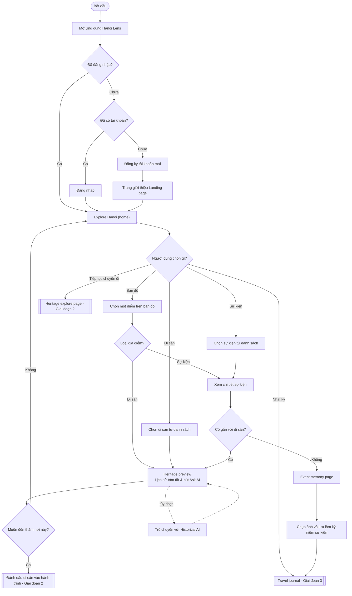
```mermaid
flowchart TD
    START([Bắt đầu]) --> OPEN[Mở ứng dụng Hanoi Lens]
    OPEN --> SIGNED{Đã đăng nhập?}
    SIGNED -- Có --> EXPLORE["Explore Hanoi (home)"]
    SIGNED -- Chưa --> HASACC{Đã có tài khoản?}
    HASACC -- Có --> LOGIN[Đăng nhập]
    HASACC -- Chưa --> SIGNUP[Đăng ký tài khoản mới]
    LOGIN --> EXPLORE
    SIGNUP --> LANDING[Trang giới thiệu Landing page]
    LANDING --> EXPLORE

    EXPLORE --> WANT{Người dùng chọn gì?}
    WANT -- Bản đồ --> MAP[Chọn một điểm trên bản đồ]
    WANT -- Di sản --> HLIST[Chọn di sản từ danh sách]
    WANT -- Sự kiện --> ELIST[Chọn sự kiện từ danh sách]
    WANT -- Nhật ký --> JOURNAL[[Travel journal - Giai đoạn 3]]
    WANT -- Tiếp tục chuyến đi --> SITE[[Heritage explore page - Giai đoạn 2]]

    MAP --> PTYPE{Loại địa điểm?}
    PTYPE -- Di sản --> PREVIEW
    PTYPE -- Sự kiện --> EDETAIL[Xem chi tiết sự kiện]
    HLIST --> PREVIEW
    ELIST --> EDETAIL

    EDETAIL --> LINKED{Có gắn với di sản?}
    LINKED -- Có --> PREVIEW
    LINKED -- Không --> MEMORY[Event memory page]
    MEMORY --> MEMPHOTO[Chụp ảnh và lưu làm kỷ niệm sự kiện]
    MEMPHOTO --> JOURNAL

    PREVIEW["Heritage preview<br/>Lịch sử tóm tắt & nút Ask AI"]
    PREVIEW -. tùy chọn .-> ASK1[Trò chuyện với Historical AI]
    ASK1 -.-> PREVIEW
    PREVIEW --> GO{Muốn đến thăm nơi này?}
    GO -- Không --> EXPLORE
    GO -- Có --> MARK[[Đánh dấu di sản vào hành trình - Giai đoạn 2]]
```

### 3.2. Giai đoạn 2: Hành trình: Đánh dấu -> Đến nơi -> Mở khóa -> Tham quan -> Nhận thưởng

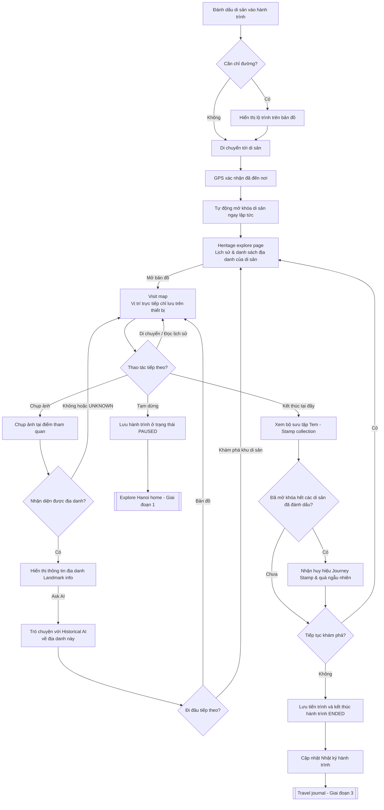
```mermaid
flowchart TD
    MARK[Đánh dấu di sản vào hành trình] --> DIR{Cần chỉ đường?}
    DIR -- Có --> ROUTE[Hiển thị lộ trình trên bản đồ]
    DIR -- Không --> TRAVEL[Di chuyển tới di sản]
    ROUTE --> TRAVEL
    TRAVEL --> ARRIVE[GPS xác nhận đã đến nơi]
    ARRIVE --> UNLOCK[Tự động mở khóa di sản ngay lập tức]
    UNLOCK --> SITE["Heritage explore page<br/>Lịch sử & danh sách địa danh của di sản"]
    SITE -- Mở bản đồ --> VISITMAP["Visit map<br/>Vị trí trực tiếp chỉ lưu trên thiết bị"]

    VISITMAP --> NEXT{Thao tác tiếp theo?}
    NEXT -- Di chuyển / Đọc lịch sử --> VISITMAP
    NEXT -- Chụp ảnh --> PHOTO[Chụp ảnh tại điểm tham quan]
    PHOTO --> IDENT{Nhận diện được địa danh?}
    IDENT -- Không hoặc UNKNOWN --> VISITMAP
    IDENT -- Có --> RESULT[Hiển thị thông tin địa danh Landmark info]
    RESULT -- Ask AI --> ASK["Trò chuyện với Historical AI<br/>về địa danh này"]
    ASK --> WHERE{Đi đâu tiếp theo?}
    WHERE -- Bản đồ --> VISITMAP
    WHERE -- Khám phá khu di sản --> SITE
    NEXT -- Tạm dừng --> PAUSE[Lưu hành trình ở trạng thái PAUSED]
    PAUSE --> EXPLORE[[Explore Hanoi home - Giai đoạn 1]]
    NEXT -- Kết thúc tại đây --> STAMP[Xem bộ sưu tập Tem - Stamp collection]
    STAMP --> ALL{Đã mở khóa hết các di sản đã đánh dấu?}

    ALL -- Có --> GIFT[Nhận huy hiệu Journey Stamp & quà ngẫu nhiên]
    ALL -- Chưa --> CONT{Tiếp tục khám phá?}
    GIFT --> CONT
    CONT -- Có --> SITE
    CONT -- Không --> SAVE[Lưu tiến trình và kết thúc hành trình ENDED]
    SAVE --> UPDATE[Cập nhật Nhật ký hành trình]
    UPDATE --> JOURNAL[[Travel journal - Giai đoạn 3]]
```

### 3.3. Giai đoạn 3: Nhật ký hành trình (Travel Journal)

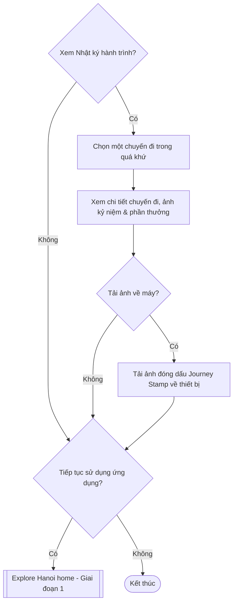
```mermaid
flowchart TD
    JOURNAL{Xem Nhật ký hành trình?}
    JOURNAL -- Có --> TRIP[Chọn một chuyến đi trong quá khứ]
    JOURNAL -- Không --> AGAIN
    TRIP --> DETAILS[Xem chi tiết chuyến đi, ảnh kỷ niệm & phần thưởng]
    DETAILS --> DL{Tải ảnh về máy?}
    DL -- Có --> DOWNLOAD[Tải ảnh đóng dấu Journey Stamp về thiết bị]
    DL -- Không --> AGAIN{Tiếp tục sử dụng ứng dụng?}
    DOWNLOAD --> AGAIN
    AGAIN -- Có --> EXPLORE[[Explore Hanoi home - Giai đoạn 1]]
    AGAIN -- Không --> FINISH([Kết thúc])
```

---

## 4. Sơ đồ Luồng Hệ Thống (System Flow — 3 Giai đoạn)

Phản ánh cách **Android Client (Java/XML)** và **Spring Boot Modulith Backend** phối hợp xử lý cho từng bước trong User Flow.

### 4.1. Giai đoạn 1: Phiên đăng nhập, Khám phá & Kỷ niệm sự kiện

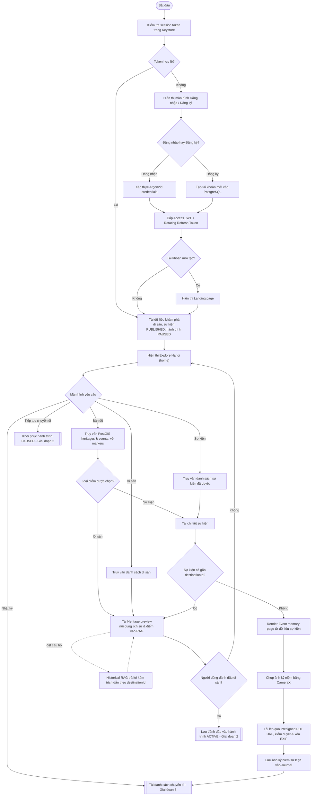
```mermaid
flowchart TD
    START([Bắt đầu]) --> TOKEN[Kiểm tra session token trong Keystore]
    TOKEN --> VALID{Token hợp lệ?}
    VALID -- Có --> LOADEX
    VALID -- Không --> FORM[Hiển thị màn hình Đăng nhập / Đăng ký]
    FORM --> CHOICE{Đăng nhập hay Đăng ký?}
    CHOICE -- Đăng nhập --> VERIFY[Xác thực Argon2id credentials]
    CHOICE -- Đăng ký --> CREATE[Tạo tài khoản mới vào PostgreSQL]
    VERIFY --> ISSUE[Cấp Access JWT + Rotating Refresh Token]
    CREATE --> ISSUE
    ISSUE --> NEWACC{Tài khoản mới tạo?}
    NEWACC -- Có --> LANDING[Hiển thị Landing page]
    NEWACC -- Không --> LOADEX
    LANDING --> LOADEX["Tải dữ liệu khám phá<br/>di sản, sự kiện PUBLISHED, hành trình PAUSED"]
    LOADEX --> SHOWEX["Hiển thị Explore Hanoi (home)"]

    SHOWEX --> SCREEN{Màn hình yêu cầu}
    SCREEN -- Bản đồ --> MARKERS[Truy vấn PostGIS heritages & events, vẽ markers]
    SCREEN -- Di sản --> HQUERY[Truy vấn danh sách di sản]
    SCREEN -- Sự kiện --> EQUERY[Truy vấn danh sách sự kiện đã duyệt]
    SCREEN -- Nhật ký --> TRIPS[[Tải danh sách chuyến đi - Giai đoạn 3]]
    SCREEN -- Tiếp tục chuyến đi --> RESUME[[Khôi phục hành trình PAUSED - Giai đoạn 2]]

    MARKERS --> PTYPE{Loại điểm được chọn?}
    PTYPE -- Di sản --> PREVIEW
    PTYPE -- Sự kiện --> EDETAIL[Tải chi tiết sự kiện]
    HQUERY --> PREVIEW
    EQUERY --> EDETAIL
    EDETAIL --> LINKED{Sự kiện có gắn destinationId?}
    LINKED -- Có --> PREVIEW
    LINKED -- Không --> MEMORY[Render Event memory page từ dữ liệu sự kiện]
    MEMORY --> CAPTURE1[Chụp ảnh kỷ niệm bằng CameraX]
    CAPTURE1 --> UPLOAD1[Tải lên qua Presigned PUT URL, kiểm duyệt & xóa EXIF]
    UPLOAD1 --> SAVEMEM[Lưu ảnh kỷ niệm sự kiện vào Journal]
    SAVEMEM --> TRIPS

    PREVIEW["Tải Heritage preview<br/>nội dung lịch sử & điểm vào RAG"]
    PREVIEW -. đặt câu hỏi .-> RAG1[Historical RAG trả lời kèm trích dẫn theo destinationId]
    RAG1 -.-> PREVIEW
    PREVIEW --> WANTGO{Người dùng đánh dấu di sản?}
    WANTGO -- Không --> SHOWEX
    WANTGO -- Có --> MARK[[Lưu đánh dấu vào hành trình ACTIVE - Giai đoạn 2]]
```

### 4.2. Giai đoạn 2: Hành trình, Kiểm tra đến nơi, Tham quan & Trao thưởng

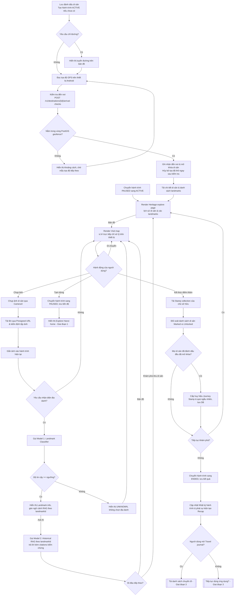
```mermaid
flowchart TD
    MARK["Lưu đánh dấu di sản<br/>Tạo hành trình ACTIVE nếu chưa có"] --> DIR{Yêu cầu chỉ đường?}
    DIR -- Có --> ROUTE[Hiển thị tuyến đường trên bản đồ]
    DIR -- Không --> GPS
    ROUTE --> GPS[Đọc tọa độ GPS trên thiết bị Android]
    GPS --> CHECK["Kiểm tra đến nơi<br/>POST /v1/destinations/{id}/arrival-checks"]
    CHECK --> INSIDE{Nằm trong vùng PostGIS geofence?}
    INSIDE -- Không --> WAIT[Hiển thị khoảng cách, chờ mẫu tọa độ tiếp theo]
    WAIT --> GPS
    INSIDE -- Có --> UNLOCK["Ghi nhận đến nơi & mở khóa di sản<br/>Hủy bỏ tọa độ thô ngay sau kiểm tra"]
    UNLOCK --> DETAIL[Tải chi tiết di sản & danh sách landmarks]
    RESUME[Chuyển hành trình PAUSED sang ACTIVE] --> SITE
    DETAIL --> SITE["Render Heritage explore page<br/>lịch sử di sản & các landmarks"]
    SITE -- Bản đồ --> VISIT["Render Visit map<br/>vị trí trực tiếp chỉ xử lý trên thiết bị"]

    VISIT --> ACTION{Hành động của người dùng?}
    ACTION -- Di chuyển --> VISIT
    ACTION -- Chụp ảnh --> CAPTURE[Chụp ảnh di sản qua CameraX]
    CAPTURE --> UPLOAD[Tải lên qua Presigned URL & kiểm định tệp ảnh]
    UPLOAD --> SAVEPH[Gắn ảnh vào hành trình hiện tại]
    SAVEPH --> IDREQ{Yêu cầu nhận diện địa danh?}
    IDREQ -- Không --> VISIT
    IDREQ -- Có --> CLASSIFY[Gọi Model 1: Landmark Classifier]
    CLASSIFY --> CONF{Độ tin cậy >= ngưỡng?}
    CONF -- Có --> INFO[Hiển thị Landmark info, gán ngữ cảnh RAG theo landmarkId]
    CONF -- Không --> UNKNOWN[Hiển thị UNKNOWN, không chọn địa danh]
    UNKNOWN --> VISIT
    INFO -- Ask AI --> RAG["Gọi Model 2: Historical RAG theo landmarkId<br/>trả lời kèm citations kiểm chứng"]
    RAG --> WHERE{Đi đâu tiếp theo?}
    WHERE -- Bản đồ --> VISIT
    WHERE -- Khám phá khu di sản --> SITE
    ACTION -- Tạm dừng --> PAUSE[Chuyển hành trình sang PAUSED, lưu tiến độ]
    PAUSE --> SHOWEX[[Hiển thị Explore Hanoi home - Giai đoạn 1]]
    ACTION -- Kết thúc điểm thăm --> STAMPS[Tải Stamp collection của chủ sở hữu]
    STAMPS --> COMPARE[Đối soát danh sách di sản Marked vs Unlocked]

    COMPARE --> ALL{Mọi di sản đã đánh dấu đều đã mở khóa?}
    ALL -- Có --> REWARD[Cấp huy hiệu Journey Stamp & quà ngẫu nhiên, lưu DB]
    ALL -- Không --> CONT{Tiếp tục khám phá?}
    REWARD --> CONT
    CONT -- Có --> SITE
    CONT -- Không --> ENDJ[Chuyển hành trình sang ENDED, lưu kết quả]
    ENDJ --> UPDJ[Cập nhật Nhật ký hành trình & phát sự kiện tạo Recap]
    UPDJ --> OPENJ{Người dùng mở Travel journal?}
    OPENJ -- Có --> TRIPS[[Tải danh sách chuyến đi - Giai đoạn 3]]
    OPENJ -- Không --> AGAIN[[Tiếp tục dùng ứng dụng? - Giai đoạn 3]]
```

### 4.3. Giai đoạn 3: Nhật ký hành trình (Travel Journal)

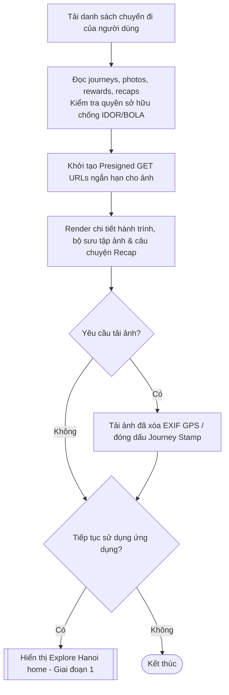
```mermaid
flowchart TD
    TRIPS[Tải danh sách chuyến đi của người dùng] --> READ["Đọc journeys, photos, rewards, recaps<br/>Kiểm tra quyền sở hữu chống IDOR/BOLA"]
    READ --> SIGN[Khởi tạo Presigned GET URLs ngắn hạn cho ảnh]
    SIGN --> RENDER[Render chi tiết hành trình, bộ sưu tập ảnh & câu chuyện Recap]
    RENDER --> DL{Yêu cầu tải ảnh?}
    DL -- Có --> DOWNLOAD[Tải ảnh đã xóa EXIF GPS / đóng dấu Journey Stamp]
    DL -- Không --> AGAIN{Tiếp tục sử dụng ứng dụng?}
    DOWNLOAD --> AGAIN
    AGAIN -- Có --> SHOWEX[[Hiển thị Explore Hanoi home - Giai đoạn 1]]
    AGAIN -- Không --> FINISH([Kết thúc])
```

---

## 5. Biểu đồ Tuần tự Trọng tâm (Core Sequence Diagrams)

### 5.1. Luồng 1: Khám phá địa điểm gần đây & Kiểm tra đến nơi (PostGIS Geofence Arrival Check & Unlock)

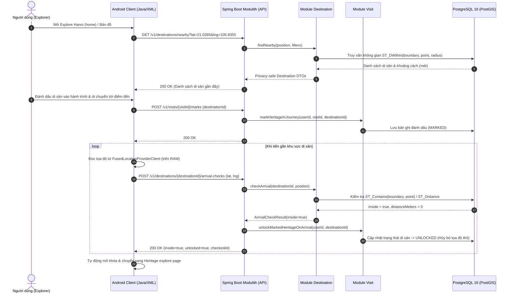
```mermaid
sequenceDiagram
    autonumber
    actor U as Người dùng (Explorer)
    participant APP as Android Client (Java/XML)
    participant API as Spring Boot Modulith (API)
    participant DEST as Module Destination
    participant VISIT as Module Visit
    participant PG as PostgreSQL 16 (PostGIS)

    U->>APP: Mở Explore Hanoi (home) / Bản đồ
    APP->>API: GET /v1/destinations/nearby?lat=21.0285&lng=105.8355
    API->>DEST: findNearby(position, filters)
    DEST->>PG: Truy vấn không gian ST_DWithin(boundary, point, radius)
    PG-->>DEST: Danh sách di sản & khoảng cách (mét)
    DEST-->>API: Privacy-safe Destination DTOs
    API-->>APP: 200 OK (Danh sách di sản gần đây)

    U->>APP: Đánh dấu di sản vào hành trình & di chuyển tới điểm đến
    APP->>API: POST /v1/visits/{visitId}/marks (destinationId)
    API->>VISIT: markHeritageInJourney(userId, visitId, destinationId)
    VISIT->>PG: Lưu bản ghi đánh dấu (MARKED)
    API-->>APP: 200 OK

    loop Khi tiến gần khu vực di sản
        APP->>APP: Đọc tọa độ từ FusedLocationProviderClient (trên RAM)
        APP->>API: POST /v1/destinations/{destinationId}/arrival-checks (lat, lng)
        API->>DEST: checkArrival(destinationId, position)
        DEST->>PG: Kiểm tra ST_Contains(boundary, point) / ST_Distance
        PG-->>DEST: inside = true, distanceMeters = 0
        DEST-->>API: ArrivalCheckResult(inside=true)
        API->>VISIT: unlockMarkedHeritageOnArrival(userId, destinationId)
        VISIT->>PG: Cập nhật trạng thái di sản -> UNLOCKED (Hủy bỏ tọa độ thô)
        API-->>APP: 200 OK (inside=true, unlocked=true, checkedAt)
    end
    APP->>APP: Tự động mở khóa & chuyển sang Heritage explore page
```

### 5.2. Luồng 2: Tải ảnh lên an toàn qua Presigned URL & Xử lý bất đồng bộ (Spring Modulith Events)

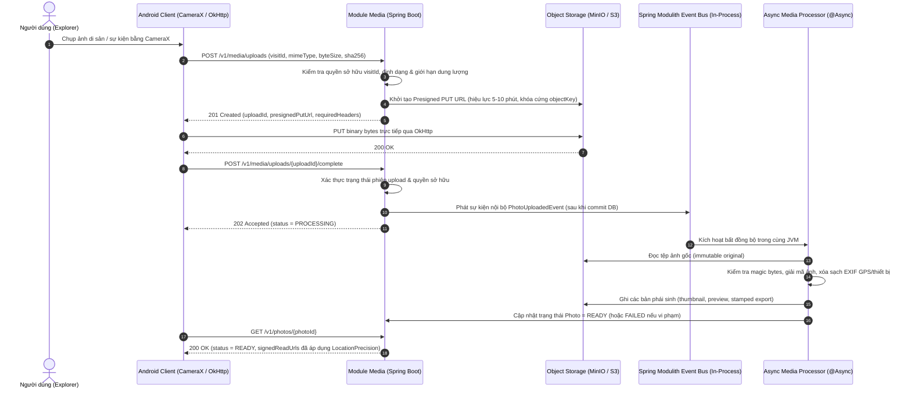
```mermaid
sequenceDiagram
    autonumber
    actor U as Người dùng (Explorer)
    participant APP as Android Client (CameraX / OkHttp)
    participant MEDIA as Module Media (Spring Boot)
    participant S3 as Object Storage (MinIO / S3)
    participant EVT as Spring Modulith Event Bus (In-Process)
    participant WORKER as Async Media Processor (@Async)

    U->>APP: Chụp ảnh di sản / sự kiện bằng CameraX
    APP->>MEDIA: POST /v1/media/uploads (visitId, mimeType, byteSize, sha256)
    MEDIA->>MEDIA: Kiểm tra quyền sở hữu visitId, định dạng & giới hạn dung lượng
    MEDIA->>S3: Khởi tạo Presigned PUT URL (hiệu lực 5-10 phút, khóa cứng objectKey)
    MEDIA-->>APP: 201 Created (uploadId, presignedPutUrl, requiredHeaders)

    APP->>S3: PUT binary bytes trực tiếp qua OkHttp
    S3-->>APP: 200 OK

    APP->>MEDIA: POST /v1/media/uploads/{uploadId}/complete
    MEDIA->>MEDIA: Xác thực trạng thái phiên upload & quyền sở hữu
    MEDIA->>EVT: Phát sự kiện nội bộ PhotoUploadedEvent (sau khi commit DB)
    MEDIA-->>APP: 202 Accepted (status = PROCESSING)

    EVT->>WORKER: Kích hoạt bất đồng bộ trong cùng JVM
    WORKER->>S3: Đọc tệp ảnh gốc (immutable original)
    WORKER->>WORKER: Kiểm tra magic bytes, giải mã ảnh, xóa sạch EXIF GPS/thiết bị
    WORKER->>S3: Ghi các bản phái sinh (thumbnail, preview, stamped export)
    WORKER->>MEDIA: Cập nhật trạng thái Photo = READY (hoặc FAILED nếu vi phạm)

    APP->>MEDIA: GET /v1/photos/{photoId}
    MEDIA-->>APP: 200 OK (status = READY, signedReadUrls đã áp dụng LocationPrecision)
```

### 5.3. Luồng 3: Nhận diện địa danh (Model 1 Vision) & Hỏi đáp lịch sử có trích dẫn (Model 2 Historical RAG)

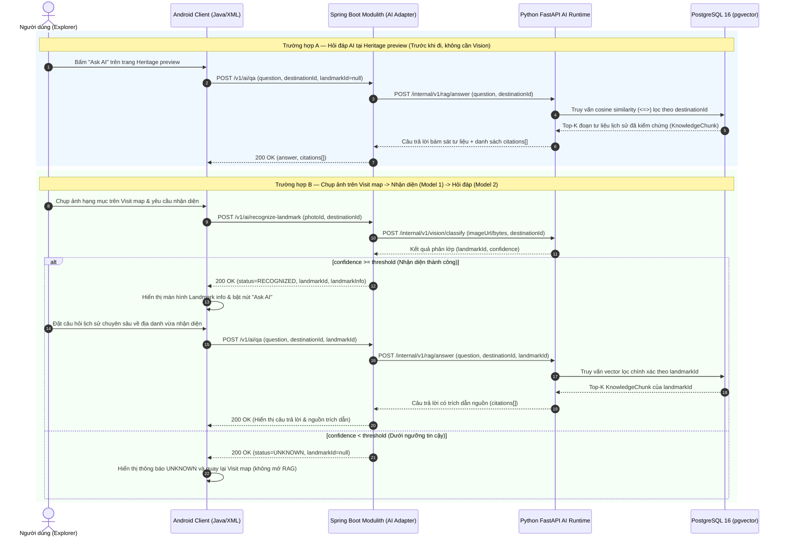
```mermaid
sequenceDiagram
    autonumber
    actor U as Người dùng (Explorer)
    participant APP as Android Client (Java/XML)
    participant SB as Spring Boot Modulith (AI Adapter)
    participant PY as Python FastAPI AI Runtime
    participant VEC as PostgreSQL 16 (pgvector)

    rect rgb(240, 248, 255)
        Note over U,VEC: Trường hợp A — Hỏi đáp AI tại Heritage preview (Trước khi đi, không cần Vision)
        U->>APP: Bấm "Ask AI" trên trang Heritage preview
        APP->>SB: POST /v1/ai/qa (question, destinationId, landmarkId=null)
        SB->>PY: POST /internal/v1/rag/answer (question, destinationId)
        PY->>VEC: Truy vấn cosine similarity (<=>) lọc theo destinationId
        VEC-->>PY: Top-K đoạn tư liệu lịch sử đã kiểm chứng (KnowledgeChunk)
        PY-->>SB: Câu trả lời bám sát tư liệu + danh sách citations[]
        SB-->>APP: 200 OK (answer, citations[])
    end

    rect rgb(245, 255, 245)
        Note over U,VEC: Trường hợp B — Chụp ảnh trên Visit map -> Nhận diện (Model 1) -> Hỏi đáp (Model 2)
        U->>APP: Chụp ảnh hạng mục trên Visit map & yêu cầu nhận diện
        APP->>SB: POST /v1/ai/recognize-landmark (photoId, destinationId)
        SB->>PY: POST /internal/v1/vision/classify (imageUrl/bytes, destinationId)
        PY-->>SB: Kết quả phân lớp (landmarkId, confidence)
        alt confidence >= threshold (Nhận diện thành công)
            SB-->>APP: 200 OK (status=RECOGNIZED, landmarkId, landmarkInfo)
            APP->>APP: Hiển thị màn hình Landmark info & bật nút "Ask AI"
            U->>APP: Đặt câu hỏi lịch sử chuyên sâu về địa danh vừa nhận diện
            APP->>SB: POST /v1/ai/qa (question, destinationId, landmarkId)
            SB->>PY: POST /internal/v1/rag/answer (question, destinationId, landmarkId)
            PY->>VEC: Truy vấn vector lọc chính xác theo landmarkId
            VEC-->>PY: Top-K KnowledgeChunk của landmarkId
            PY-->>SB: Câu trả lời có trích dẫn nguồn (citations[])
            SB-->>APP: 200 OK (Hiển thị câu trả lời & nguồn trích dẫn)
        else confidence < threshold (Dưới ngưỡng tin cậy)
            SB-->>APP: 200 OK (status=UNKNOWN, landmarkId=null)
            APP->>APP: Hiển thị thông báo UNKNOWN và quay lại Visit map (không mở RAG)
        end
    end
```

### 5.4. Luồng 4: Kết thúc hành trình, Trao thưởng & Tạo Recap bất đồng bộ

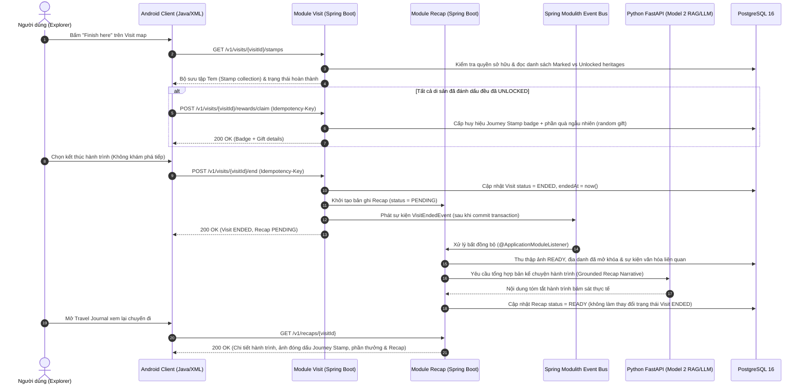
```mermaid
sequenceDiagram
    autonumber
    actor U as Người dùng (Explorer)
    participant APP as Android Client (Java/XML)
    participant VISIT as Module Visit (Spring Boot)
    participant RECAP as Module Recap (Spring Boot)
    participant EVT as Spring Modulith Event Bus
    participant PY as Python FastAPI (Model 2 RAG/LLM)
    participant DB as PostgreSQL 16

    U->>APP: Bấm "Finish here" trên Visit map
    APP->>VISIT: GET /v1/visits/{visitId}/stamps
    VISIT->>DB: Kiểm tra quyền sở hữu & đọc danh sách Marked vs Unlocked heritages
    VISIT-->>APP: Bộ sưu tập Tem (Stamp collection) & trạng thái hoàn thành

    alt Tất cả di sản đã đánh dấu đều đã UNLOCKED
        APP->>VISIT: POST /v1/visits/{visitId}/rewards/claim (Idempotency-Key)
        VISIT->>DB: Cấp huy hiệu Journey Stamp badge + phần quà ngẫu nhiên (random gift)
        VISIT-->>APP: 200 OK (Badge + Gift details)
    end

    U->>APP: Chọn kết thúc hành trình (Không khám phá tiếp)
    APP->>VISIT: POST /v1/visits/{visitId}/end (Idempotency-Key)
    VISIT->>DB: Cập nhật Visit status = ENDED, endedAt = now()
    VISIT->>RECAP: Khởi tạo bản ghi Recap (status = PENDING)
    VISIT->>EVT: Phát sự kiện VisitEndedEvent (sau khi commit transaction)
    VISIT-->>APP: 200 OK (Visit ENDED, Recap PENDING)

    EVT->>RECAP: Xử lý bất đồng bộ (@ApplicationModuleListener)
    RECAP->>DB: Thu thập ảnh READY, địa danh đã mở khóa & sự kiện văn hóa liên quan
    RECAP->>PY: Yêu cầu tổng hợp bản kể chuyện hành trình (Grounded Recap Narrative)
    PY-->>RECAP: Nội dung tóm tắt hành trình bám sát thực tế
    RECAP->>DB: Cập nhật Recap status = READY (không làm thay đổi trạng thái Visit ENDED)

    U->>APP: Mở Travel Journal xem lại chuyến đi
    APP->>RECAP: GET /v1/recaps/{visitId}
    RECAP-->>APP: 200 OK (Chi tiết hành trình, ảnh đóng dấu Journey Stamp, phần thưởng & Recap)
```
